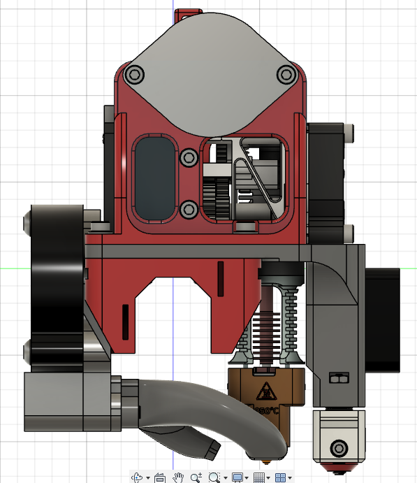

# Trinity
A variation of the [Valkyrie](https://github.com/RoyBerntsenDesign/Project-Valkyrie/tree/main) project, a DIY 3D printer.

## Specifications
- Able to print high temp materials up to 450C nozzle and 80C chamber
- Frame footprint - 500mm x 520mm x 750mm
- Print volume - 320mm x 320mm x 320mm

## Features
- Automated bed-tramming with triple independent Z lifting the bed via maxwell coupling
- Inverted coreXY for only 2 toothed idlers instead of 6 on standard coreXY
- Easy access and simple belt tension of all belts
- All stepper motors located outside the chamber
- Lightweight tool-head riding on carbon X-axis
- High quality idlers and other key components
- High temp belts 9mm gates 2GT on all axis
- Solid frame with low center of gravity
- Sensorless homing on X and Y axes

## BOM Additions
| Item | Quantity | Use |
| ------------- | ------------- | ------------- |
| 400mm MGN12H rails | 3 | In place of the 350mm Z rails |
| 9mm hi-temp 2GT belt | 500mm | 50mm Z travel increase |
| 2820 L bracket | 2 | Top frame side supports |
| 480mm 2020 extrusion | 2 | Top frame sides |
| 389mm 2020 extrusion | 1 | Rear Z |
| 640mm x 490mm PC Panel | 1 | Front door |
| 640mm x 470mm ACM Panel | 1 | Rear panel (CNC preferred) |
| 650mm x 460mm PC Panel | 2 | Side panels (ACM optional) |
| 520mm x 80mm ACM Panel | 2 | Side skirts|
| 506mm x 80mm ACM Panel | 2 | Front / Rear skirts |
| Phaetus Dragon UHF | 1 | Without nozzle extension (mini) |
| M2.5 x 12mm SHCS | 4 | Hotend mount screws (in place of 8mm) |
| [500w AC PTC heater](https://www.amazon.com/gp/product/B07P5NCR2F/) | 1 | Chamber heating element |
| 24v 5020 Fan | 4 | Chamber heater / Skirt fans |
| DC / AC solid state relay | 1 | Chamber heater relay |